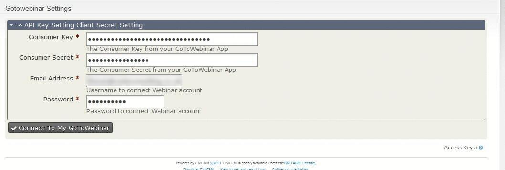
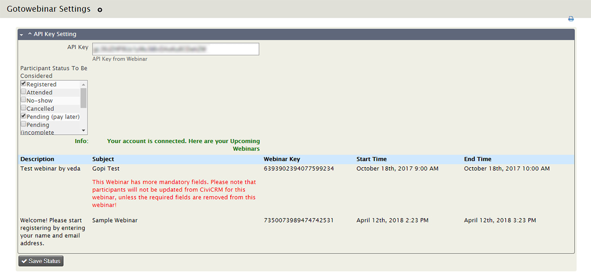
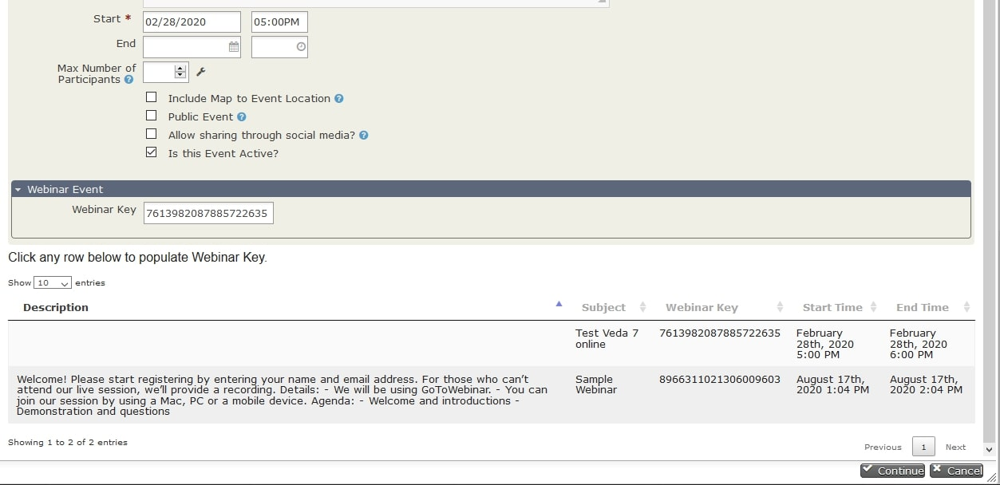

# GoToWebinar Integration for CiviCRM Events #

### Overview ###

CiviCRM Events can be integrated with GoToWebinar

### Installation ###

* Install the extension in CiviCRM. More details [here](https://docs.civicrm.org/sysadmin/en/latest/customize/extensions/#installing-a-new-extension) about installing extensions in CiviCRM.
* Configure GoToWebinar details in **Events >> GoToWebinar Settings** (civicrm/gotowebinar/settings?reset=1)

* Create an "app" on the GoToWebinar apps page. Copy the Consumer Key and Consumer Secret into the settings page in CiviCRM. You will also need to use the username and password that you use to log into the GoToWebinar website. The username and password will not be saved in CiviCRM.

* The authentication will get refreshed occassionally. It will attempt to reauthenticate when trying to fetch webinar information on event pages and on the settings page. If you see a notice that GoToWebinar is disconnected, first try to refresh the settings page. If that doesn't work you may need to provide your username and password again. That should be rare.

* After the successful authentication, list of upcoming webinars will be fetched and displayed on the screen. (Note : Firstname, lastname & email are the only fields that get pushed to webinar for now. Any webinars with additional mandatory fields will not be getting the participants added from CiviCRM).

### Usage ###

* Setup CiviCRM Event with a Webinar Key

* When participants register for that civiCRM Event, those participants are automatically created for GoToWebinar Event

### Changelog ###

#### Ver 3.0.1 ####
* Updated Installations instructions from FreeForms fork 
* Changed labels on settings screen to mirror GoToWebinar as per FreeForms fork

#### Ver 3.0.0 ####
* Migrated to a new Webinar API which uses OAuthv2 standard
* Auto refresh to obtain new access token and refresh token

#### Ver 2.0.0 ####
* Migrated to new Webinar API.
* Re-Autheticate when the accesstoken become invalid/expired
* Display warning, if a webinar has additonal mandatory fields
* Display failure messages on thank you page, if push pariticipant to Webinar failed

### Support ###

support@vedaconsulting.co.uk
